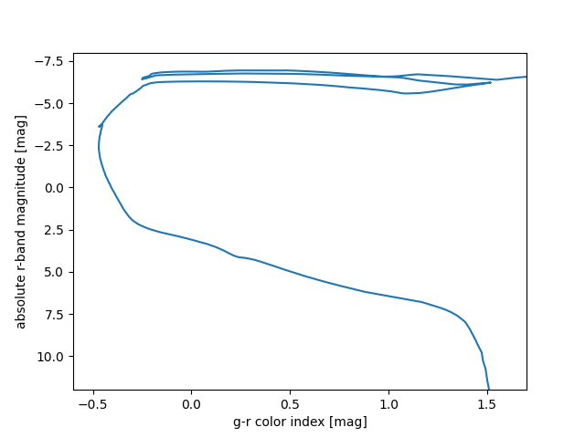

# Isochrone fitting

more coming soon

# Installation and dependencies

This package requires the following standalone python packages to run, most of which are likely already installed
on any common astronomy system:

* astropy
* matplotlib
* numpy
* scipy
* pandas 

## installation via pip (recommended)

The recommended way of installing this package is available via pip. To install, simply run

```
pip install uwastro465isos
```

new pip releases are handled automatically via GitHub, so this provides access to the latest stable version.


## How to use

```python
import uwastro465isos.isochrones as uwiso

# if using the Sloan/SDSS u/g/r/i/z filters
iso = uwiso.Isochrone_Sloan()

# alternatively, for the traditional UBVRI filters:
iso = uwiso.Isochrone_Johnson()

#
# Learn what parameters are available:
#

# for log ages:
print(iso.get_list_of_ages())

# for metallicities:
print(iso.get_list_of_metallicities())

# for bandpasses:
print(iso.get_list_of_magnitudes())
```

Results:
```jupyter
>>> print(iso.get_list_of_ages())
[ 6.6   6.65  6.7   6.75  6.8   6.85  6.9   6.95  7.    7.05  7.1   7.15
  7.2   7.25  7.3   7.35  7.4   7.45  7.5   7.55  7.6   7.65  7.7   7.75
  7.8   7.85  7.9   7.95  8.    8.05  8.1   8.15  8.2   8.25  8.3   8.35
  8.4   8.45  8.5   8.55  8.6   8.65  8.7   8.75  8.8   8.85  8.9   8.95
  9.    9.05  9.1   9.15  9.2   9.25  9.3   9.35  9.4   9.45  9.5   9.55
  9.6   9.65  9.7   9.75  9.8   9.85  9.9   9.95 10.   10.05 10.1 ]

>>> print(iso.get_list_of_metallicities())
[-2.  -1.5 -1.  -0.5  0. ]

>>> print(iso.get_list_of_magnitudes())
['mbolmag', 'umag', 'gmag', 'rmag', 'imag', 'zmag']
```

```python
# To select an individual isochrone:
one_iso = iso.select_isochrone(log_age=7.3, metallicity=-0.5)
```

Finally we can make a plot
```python
import matplotlib.pyplot as plt

fig, ax = plt.subplots()

g_r = one_iso['gmag'] - one_iso['rmag']
r = one_iso['rmag']
ax.plot(g_r, r)

ax.set_xlim((-0.6, 1.7))
ax.set_ylim((12,-8))
ax.set_xlabel("g-r color index [mag]")
ax.set_ylabel("absolute r-band magnitude [mag]")
fig.show()
```
